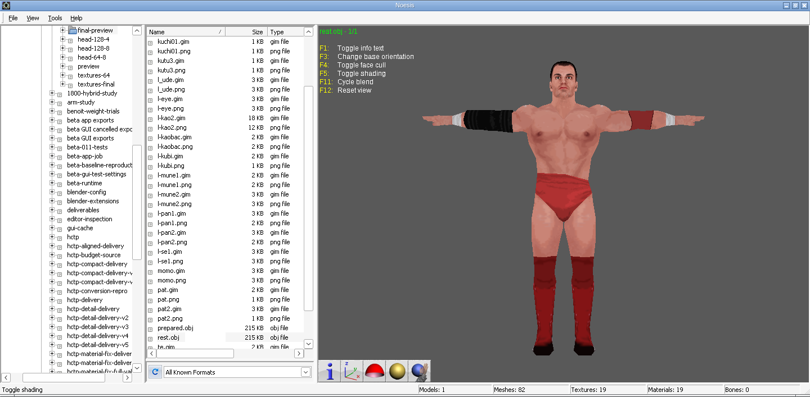
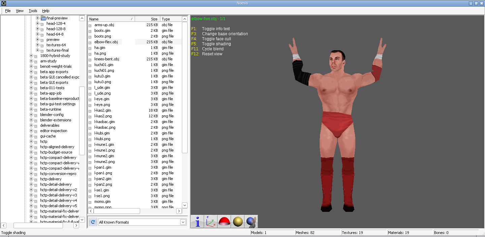

# 1800 hybrid PSP size-budget trial

The geometry-preserving hybrid review has now been converted into a **147,456-byte (144 KiB) PSP PAC**. It retains the hybrid weighting method with less geometry and PSP textures, using the original PSP SVR 2007 Kurt base. This is an experimental candidate for the user's SVR 2011 PPSSPP test; successful cloud export does not establish in-game compatibility.

- [Download the PAC](../downloads/1800-PSP-hybrid-144KiB.pac)
- [Download PAC, preview YOBJ, textures and screenshots](../downloads/1800-PSP-hybrid-144KiB-test-bundle.zip)
- [Detailed report](../downloads/1800-hybrid-budget/report.json)

Inject the `.pac` as the wrestler PAC using the established containing-archive/ARC rebuild workflow. `preview/prepared.yobj` is the exact model inside it after native BPE decompression; it is an inspection asset rather than the PAC to inject.

## Budget and changes

The unreduced hybrid model, compressed with 64-pixel indexed4 textures, occupied 172,032 bytes (168 KiB). Regional decimation was therefore necessary. Its first reduced build occupied 140 KiB; the available space was used for the final 128×128 indexed8 face texture.

| Measure | Original HCTP | Budgeted PSP |
| --- | ---: | ---: |
| PAC bytes | 553,728 | 147,456 |
| Triangles | 3,018 | 2,276 |
| Native source position records | 2,041 | Different target layout |
| Vertices including original UV splits | 2,410 | 2,277 after palette/part packing |
| Meshes | 13 | 57 PSP draw meshes |
| Bones | 100 | Original 79-bone PSP base |
| Textures | 19 | 19 |

The original 148.5 KiB destination slot is 4.5 KiB larger than this PAC. Counts distinguish native PS2 position records from decoded vertices with UV splits and from the PSP export's duplicated palette/part vertices; they are not interchangeable counts.

| PSP bone-weight region | Before | After | Retained |
| --- | ---: | ---: | ---: |
| Head | 943 | 755 | 80.1% |
| Arms, including shoulders and hands | 1,140 | 912 | 80.0% |
| Torso | 447 | 291 | 65.1% |
| Legs | 488 | 318 | 65.2% |

Regions are defined by the existing hybrid weights on the target PSP skeleton. Weighted Blender collapse carries those groups through simplification, protects shared region seams and recalculates area-weighted smooth normals. The strongest four influences are retained after interpolation and normalized; maximum removed weight mass at a vertex is 0.010121687343684016 (about 1.01%). Body weights therefore interpolate with changed geometry; the earlier unchanged-body-weight claim applies to the unreduced review.

The source is rigidly fitted to the same target rig as the earlier review. No new alignment or rig retargeting is introduced. Triangle packing uses separate oriented strips and float vertex weights. It does not use the earlier fixed-point weight/degenerate strip-bridge experiment. Mesh bounds are updated to the generated geometry; source faces are assigned to ordinary PSP body parts and split into palettes of at most eight bones.

The face uses 128×128, 256-color GIM. Other textures use a maximum dimension of 64 and 16-color GIM, with necessary PSP block padding. Original RGBA pixels feed conversion; texture alpha remains in indexed palettes, with resizing/quantization loss and the existing near-opaque/near-transparent alpha snapping. Vertex alpha uses the working opaque PSP base profile. Texture resolution/color depth differ from the full-source review.

Native Yukes BPE compression stores section 2's model at 119,311 bytes and section 9's texture table at 21,026 bytes. The model expands to 196,256 bytes; the texture table expands to 47,712 bytes. Compression reduces stored size, not runtime allocation. Base section 8 remains byte-identical. PAC sections and expanded YOBJ relocation data retain 16-byte alignment.

## Verification

- 43 focused codec, HCTP reader, hybrid weighting, region, preparation, texture, material and repacking tests passed.
- All serialized palettes, positions, normals, colors, UVs, float weights and oriented triangles match the prepared model. PSP bone-table bytes are unchanged; the native YOBJ reader reports no warnings.
- Every GIM decodes to the exact converted PNG pixel/palette data. Original PS2 PNG pixels are not claimed unchanged after budgeting.
- Two separately implemented local BPE decoders agree on the two final sections and ten supplied native PSP reference sections. This is not a third-party decoder check.
- The exact native preview YOBJ and texture table are recovered from the PAC's BPE sections. Unrelated base section 8 and both original input PAC hashes are unchanged.
- The delivered assets rebuild into a byte-identical PAC; ZIP CRCs and all 62 manifested sizes/hashes were checked.
- Actual Noesis captures use the requested orientation, face-cull and shading toggles once each. Posed OBJs use the weights read from the final native YOBJ. OBJ previews have baked positions and no skeleton; Noesis generates their preview normals rather than displaying the native normals directly.

The beta app and pinned backend are unchanged. The bundle includes an exact PAC rebuild script plus session build records; it is not a new Windows beta release.

PAC SHA-256: `ca9cb1992ef65ee3dce873cfeb473cc970388b512dd93a3b97b7d34575da2d86`.
