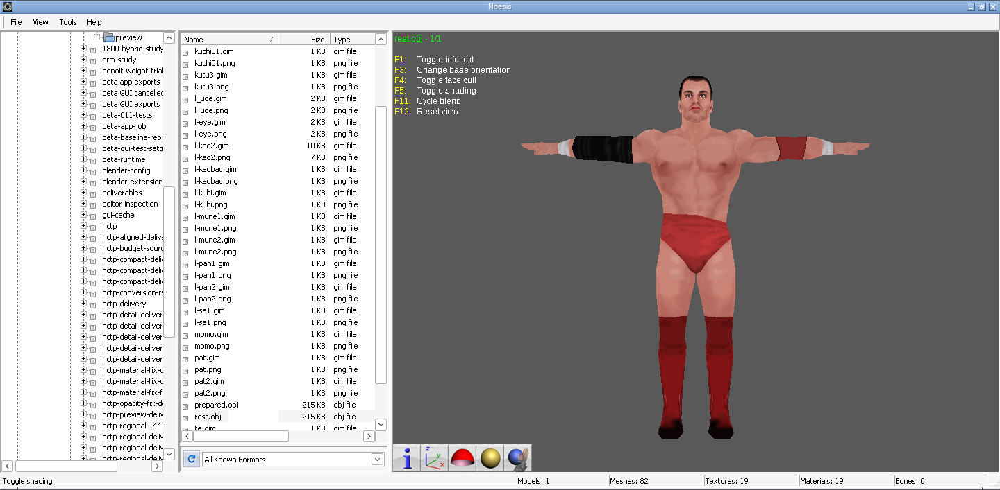
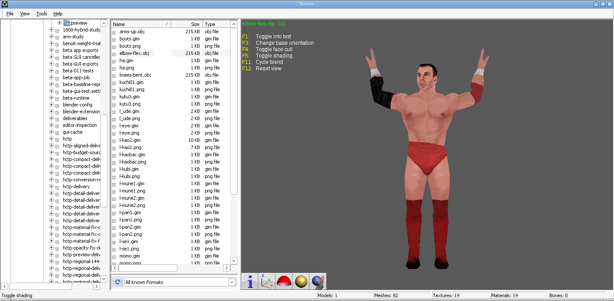

# 1800 hybrid: half-size textures

This variant changes texture resolution only, starting from the published 144 KiB hybrid PAC. The model section, including its compressed bytes, and base section 8 are byte-for-byte identical. Container section sizes and final padding are rebuilt for the smaller texture section.

- [Download the 136 KiB PAC](../downloads/1800-PSP-hybrid-half-textures.pac)
- [Download PAC, preview YOBJ, textures and screenshots](../downloads/1800-PSP-hybrid-half-textures-test-bundle.zip)
- [Full per-texture dimensions and validation](../downloads/1800-hybrid-half-textures/report.json)

| Size | Previous | New |
| --- | ---: | ---: |
| PAC | 147,456 bytes / 144 KiB | 139,264 bytes / 136 KiB |
| Combined model-referenced GIM files | 47,088 bytes | 23,536 bytes |
| Compressed texture section | 21,026 bytes | 11,275 bytes |
| Expanded texture table, including names/entries | 47,712 bytes | 24,160 bytes |

The GIM files retain **49.983%** of their former combined size. Individual textures differ because power-of-two resolution steps, PSP swizzle block alignment and fixed header/palette sizes prevent exactly halving each file. Every referenced texture has a smaller resolution. The face is 128×64 instead of 128×128; most formerly 64×64 body maps are 32×32, while arm and eye maps are 64×32. Smaller maps take one valid half-resolution step.

Existing palette indices are downsampled with nearest-neighbor sampling. All RGBA palette entries, including alpha values, and all 4-bit/8-bit color depths remain unchanged. No new colors, quantization or alpha snapping are introduced. Normalized UVs are unchanged; the rectangular face and arm maps reduce sampling detail rather than changing how the textures map onto the model.

Geometry, normals, materials, skeleton and weights stay unchanged: 2,277 vertices, 2,276 triangles, 57 native PSP meshes and 79 bones. No decimation, alignment, weight transfer or YOBJ serialization is rerun. `preview/prepared.yobj` is the same expanded YOBJ as in the 144 KiB bundle; all OBJ/MTL/DAE preview files are also copied unchanged and reference the replacement images.

The PAC section hashes/bytes, source file hash, native model counts, all 19 GIM pixel/palette round trips, BPE round trip and 16-byte section alignment were checked. Sixteen relevant texture/repacking/codec tests passed. Both screenshots were captured in actual Noesis sessions using the requested orientation, face-cull and shading toggles once each. ZIP CRCs and all 54 manifested file hashes/sizes were verified.

The original 144 KiB artifact and the beta app remain unchanged. This variant still needs the user's SVR 2011 PPSSPP test.





Reproduce from the repository root with the existing Python environment:

```sh
python -m tools.reduce_psp_textures \
  downloads/1800-PSP-hybrid-144KiB.pac NEW_OUTPUT_DIRECTORY
```

The output directory must be new. The tool changes only the main model-referenced texture table (section 9); auxiliary base textures/data in section 8 are retained with the rest of the base PAC.

PAC SHA-256: `04ff929f8621a768f7c7d3f0a9c2c6e680a587857ee0532044c8dc64880014b0`.
