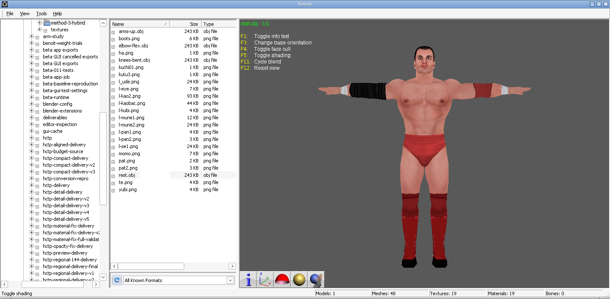
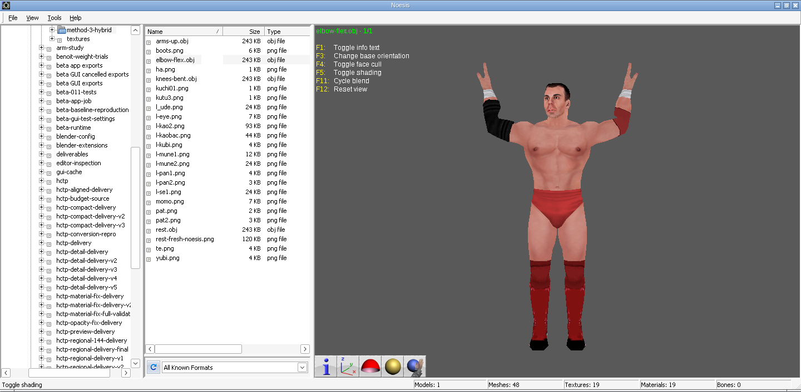
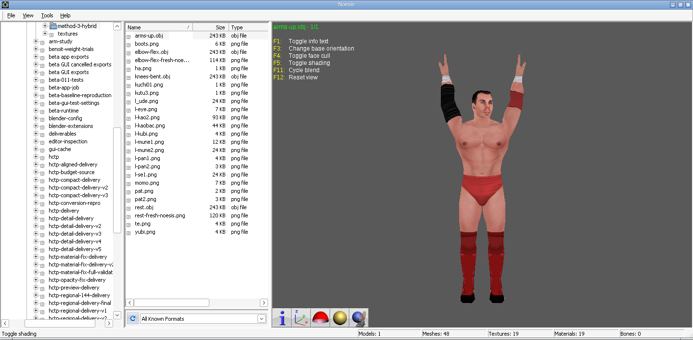

# 1800 hybrid weighting review

The Benoit trial's method 3 has been applied to the original HCTP `1800.pac`, using the original PSP SVR 2007 `Kurt-Angle-Ring.PAC` as the target rig/head donor. This is the base used for the earlier 1800 conversion. Unlike the Benoit comparison, this is not a matched native PSP model of the same wrestler.

[Download the review bundle](../downloads/1800-hybrid-weight-review.zip).

## Result

The full source model renders with textures in the T-pose, elbow-flex and raised-arm Noesis views. The arms remain connected in both posed tests. All geometry is retained, avoiding the earlier aggressive reduction that removed arm faces. This demonstrates the weighting preview; it does not establish PSP engine behavior.







## What changed

- A single whole-model landmark fit aligns source geometry to the target skeleton: scale 0.9848508359266518 plus the recorded rotation/translation in `common-alignment.json`. No local reshaping or decimation.
- Source body weights are decoded from the original HCTP VIF packets, normalized for at most 5.96e-8 float sum error, and mapped by bone name to the PSP rig. Weighted eyebrow bones absent from the target map to their named ancestor `atama`.
- The head mask is original source weight mass in the `atama` subtree. 683 vertices receive some blend with nearest ordinary PSP surface weights. Blended weights retain up to four influences and are normalized.
- Original source-only dummy bones with exactly zero assigned weight are ignored. The analysis mapper now handles an unused independent object root (`lance`); weighted roots without a named target ancestor still fail explicitly.
- All 13 source meshes, 19 textures, UVs and triangle topology are retained. Outside the head mask, assigned body weights differ from the mapped source by at most 1.11e-16.

| Quantity | Original | Review |
| --- | ---: | ---: |
| Native source position records | 2,041 | Not reserialized |
| Decoded vertices including original UV splits | 2,410 | 2,410 |
| Triangles | 3,018 | 3,018 |
| Source meshes | 13 | 13 |
| Textures | 19 | 19 |
| Skeleton bones | 100 source | 79 target |
| Original PAC size | 553,728 bytes | Original unchanged; no new PAC |

Decoded PNG pixels, including alpha, match the original-source texture decoder output exactly. OBJ material groups reference these PNGs; native game shaders, vertex colors and render-state headers are not reproduced. Noesis generates preview normals. OBJ contains baked pose positions and no skeleton, so its viewer bone count is zero.

`weighted-review.blend` contains an actual 79-bone review armature, source mesh/material/UV structure, assigned vertex groups and packed textures. Frame 1 is the T-pose, frame 21 elbows bent, frame 41 arms raised, and frame 61 knees bent. Saved at frame 21. Bone axes/tails are converted for Blender review; this is not a serialized PSP skeleton.

## Validation

- 18 focused HCTP reader, weighting and preparation tests passed, including the new unused-root regression and rejection of a weighted unmatched root.
- Independent Blender armature evaluation checked all 2,410 vertices in four poses. Maximum position difference from the analytical preview was 4.14e-6 model units.
- All four OBJ files preserve vertex/triangle counts and original UVs to text-output precision. Rest pose equals aligned input within 1e-8.
- Both original PAC hashes remain unchanged. All 19 PNGs preserve decoded RGBA pixels exactly. Duplicate source-position seams remain coincident in each pose.
- The ZIP's CRC and all 45 manifested file sizes/hashes were verified.

The beta pipeline is unchanged. This full-geometry review is not a replacement PAC, has not been fitted to the approximately 148 KiB stored PAC budget, and has not been tested in PPSSPP. The screenshots come from actual Noesis sessions using the requested orientation, face-cull and shading toggles once each.

To reproduce with the supplied original PACs available, use the bundle's `build_inputs.py` after adjusting its paths, then:

```sh
python -m tools.weight_trial_review local/1800-hybrid-study 3
BLENDER_USER_CONFIG=/workspace/Wrestler-Importer/local/blender-config \
BLENDER_USER_EXTENSIONS=/workspace/Wrestler-Importer/local/blender-extensions \
blender --background --python-exit-code 1 \
  --python tools/blender_weight_study.py -- local/1800-hybrid-study review 3
```
