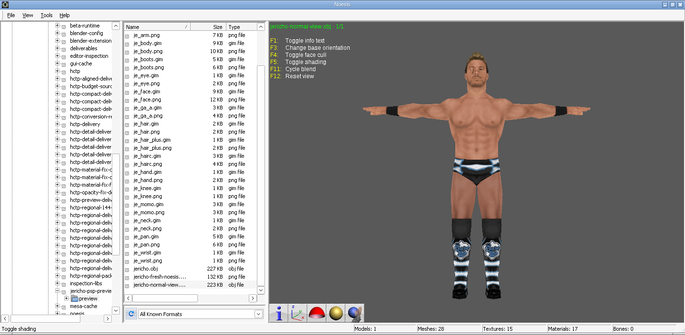
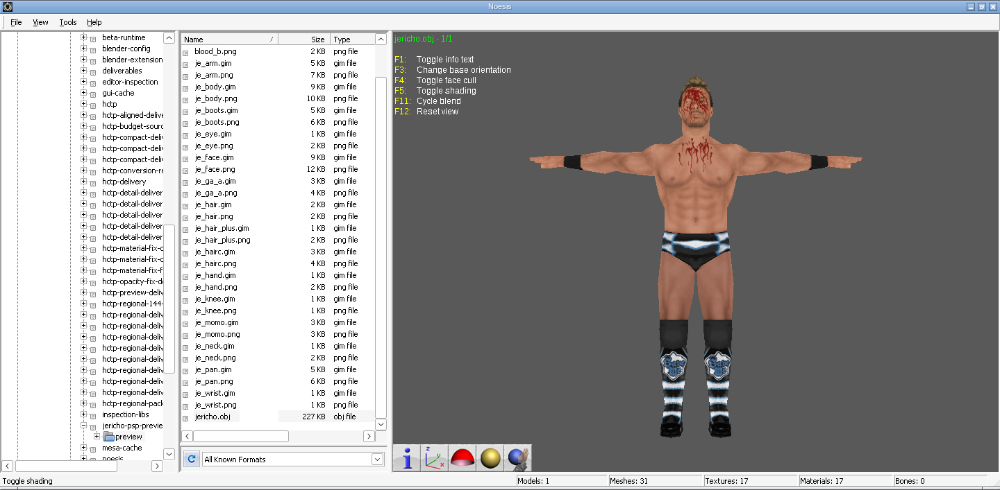

# Chris Jericho PSP: unchanged native preview

[Download the OBJ, original-resolution textures, extracted YOBJ and Noesis screenshots](../downloads/Chris-Jericho-PSP-Noesis-preview.zip).

The uploaded `Chris Jericho.pac` remains unchanged: 140,032 bytes, SHA-256 `dd5a606e28f1bedb466e6ebeaf25bccde2251066380c0ecaa75fe136a58bd67d`. Main model section 2 is BPE-expanded and copied exactly. The preview includes 17 original GIMs and PNGs whose RGBA pixels exactly match those GIMs. No texture resize, decimation, rig replacement, weight transfer, model alignment or posing was performed.

`jericho.obj` contains all 25 native main-model meshes: 1,509 vertices and 1,749 triangles. It retains native UVs, normals and oriented triangle-strip faces. Coordinates/normals are expressed as `(x,z,-y)` for the established viewing convention without scaling or translation. OBJ contains geometry, not the source's 83-bone skeleton or native game shader/control state. Secondary nested assets in PAC section 100 are outside this main-model preview.

The full OBJ displays conditional blood-effect faces in Noesis. `jericho-normal-view.obj` is a separate viewing copy hiding 92 triangles that reference `blood`/`blood_b`, leaving 1,657 visible triangles. All original vertices and the complete OBJ remain available. This does not change the PAC.

Both actual Noesis captures apply orientation, face-cull and shading toggles once each. PNG round trips, full OBJ counts, original PAC hash and ZIP CRC/43 manifested file hashes were verified.

## Mesh-count comparison raised by the user

| Measure | Native Jericho | Converted 1800 |
| --- | ---: | ---: |
| Noesis full-OBJ reported meshes | 31 | 82 |
| Native YOBJ meshes | 25 | 57 |
| Native material records | 45 | 96 |
| Native triangle strips | 453 | 804 |
| Triangles | 1,749 | 2,276 |

Noesis's OBJ grouping does not directly equal the native mesh count, but both measures show that 1800 is more fragmented. The conversion partitions source faces among PSP body parts and eight-bone palettes, creating extra draw chunks. Its packing cost also favors smaller palette/vertex records when enlarging an existing palette would cost more space. Native Jericho uses eight-slot palettes in 17 of its 25 meshes; it has fewer mesh and strip boundaries overall.

Additional mesh/material/strip segmentation can increase draw/setup overhead. These counts alone do not establish the cause of the intermittent entrance/victory crashes. Consolidating the converted model's draw meshes while holding geometry and weights fixed would be a useful controlled follow-up; no such conversion was performed in this read-only preview task.
