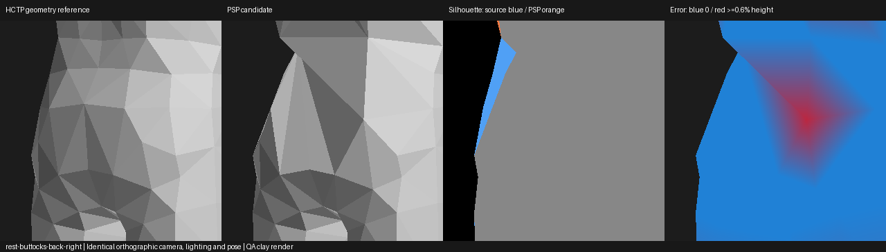
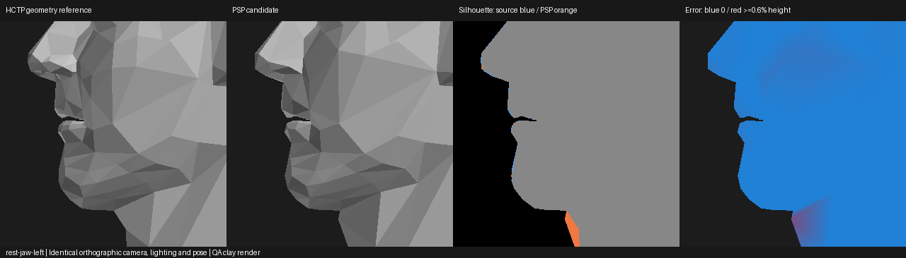
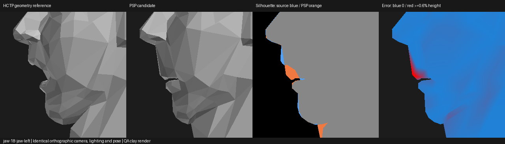
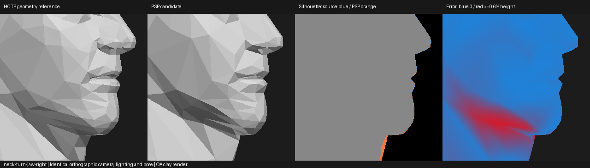

# Automated HCTP geometric quality review

The separate `model_qa` package compares an original HCTP model with an exported
PSP PAC. It produces an offline HTML report, JSON metrics, aligned geometry,
matching comparison renders, heatmaps, and input/output SHA-256 manifests.
It does not write PACs, modify the converter, apply corrections, or replace an
accepted model. Existing outputs cannot be overwritten.

[Download the Lance/Jericho study](../downloads/HCTP-Model-QA-0.1-study.zip).
Extract it and open `index.html`; each case links to its complete report.

## Run a comparison

From the repository root, using Python 3.13:

```powershell
py -3.13 -m pip install -r requirements-qa.txt
py -3.13 -m model_qa compare --source "C:\models\1800.pac" --converted "C:\exports\Lance.pac" --output "C:\reviews\Lance-01" --profile model_qa/profiles/hctp-provisional-v1.json --samples 24000 --resolution 320
```

`--stage LABEL=PATH` adds an ordered saved JSON/PAC stage, in the converter's
target model space. Repeat it for weight transfer, reduction and packing.
The Python API also accepts `space="source"` to apply the same fixed alignment
to a source-space stage. Supply the actual processing order, not a desired
diagnosis. Stage tracing only identifies the first **supplied, measured** state
with a deviation. Missing intermediate states cannot establish an exact cause.

The optional dependencies are NumPy/Pillow, SciPy, Trimesh and Rtree. The
comparison does not require Blender, Noesis, a mesh-editor executable or an
ISO. `--no-animation` and `--no-renders` reduce work and omit those checks;
`--save-depth` additionally stores numeric float32 per-view depth arrays.
By default metrics use float64 and the report saves compact PNGs instead of
large depth arrays. Completion returns zero even when human review is needed;
`--fail-on-review` returns two after saving a flagged report.

## Reference, alignment and geometry checks

The original HCTP mesh and weights are decoded directly from the uploaded PAC.
The final model is read from its actual PSP PAC section and checked with the
existing strict native YOBJ auditor. Twelve shared rest-bone landmarks define
one uniform scale, proper rotation and translation. That transform stays fixed
for all saved stages and poses. There is no nonuniform scaling or independent
candidate fitting to conceal a local defect.

Canonical coordinates are X toward the wrestler's left, Y up, Z forward. For
these files the native-to-canonical rotation is `(x, -y, -z)`: **native negative
Z is the front**. The reports retain the transform and landmark residuals.
Reference-pose normalization currently supports the decoded HCTP/PSP bind poses
used here, not arbitrary pre-posed input or unidentified game profiles.

Measurements use 24,000 deterministic, area-weighted triangle-surface samples
in **each** direction, nearest-triangle queries and independent vertex error
queries. They do not assume matching indices, vertex counts or topology. Each
of 15 fixed anatomical regions reports mean/RMS/p95/p99/max distances and
coverage, approximate proportions, normal changes, curvature diagnostics,
worst reference samples and actual candidate mesh/local-vertex records.

The renderer uses identical source-framed orthographic cameras and clay
lighting for front, back, both sides and four three-quarter views, plus face,
jaw, chin, nose, eyes, neck, torso, waist, pelvis, buttocks, shoulders, hands and
feet close-ups. Reports include silhouette overlap/edge distances, signed
visible-surface depth and projected depth-integral proxies. A silhouette can
remain almost identical while interior surfaces lose substantial depth.
Open garment/body patches do not define a closed anatomical volume; the report
does not misrepresent a projected depth integral as actual volume loss.

Diagnostic topology checks count disconnected components, boundaries,
degenerate/duplicate triangles and nonmanifold edges. Coincident rest records
are also tracked through poses for seam opening. Temporary position welding is
used only for diagnostics; original UV/normal/palette splits remain untouched.
Hair, eyes, teeth, garments and mouth contacts can legitimately be separate.

## Animated jaw checks

Static similarity alone cannot test Jericho's reported defect, which appears
only during animation. The primary analytical pose comparison places original
HCTP geometry and its source weights, mapped by name/ancestor, on the **same PSP
skeleton** as the final mesh. Both receive identical bone controls. This isolates
geometry/weight changes from differences between the two games' rig pivots.
Additional controls compare the original HCTP rig against the mapped PSP rig
to show the amount attributable to skeleton adaptation.

Twelve poses exercise standing, alternating walk steps, bending, crouching,
shoulders, neck, head and four jaw-opening angles. The report flags increased
regional error beyond the static baseline and includes selected matching pose
renders. It also reports area-weighted cranial/neck/body influence mass by
bone ancestry. This is analytical linear-blend skinning, **not actual game
animation clips or proof of PPSSPP stability**. Facial controller semantics
and absent HCTP bones remain review limitations.

## Tolerances and preservation

The included provisional profile uses selected visually accepted controls:
Jericho's static body regions and Lance's static face. Lance's unresolved rear
and Jericho's animated jaw are held out. Regional limits are 1.5 times observed
control deviations, with explicit engineering floors. No verified clean
animation clips are available, so pose limits remain provisional.

To calibrate additional reviewed controls:

```powershell
py -3.13 -m model_qa calibrate --controls controls.json --output new-profile.json
```

The manifest has `controls` entries with `label`, relative `report` path and
explicit `trusted_regions`. Do not select a defective region as its own control.
Small sample/coverage regions return insufficient evidence, not a pass. Flags
mean review is warranted, not that every intended LOD or rig difference is wrong.
Finite sampling and fixed anatomical boxes can miss small or poorly localized
defects; neither these thresholds nor the native-format audit certify the engine.

Input hashes are checked before and after the full run. Reports record the
actual candidate PAC hash, size, skeleton hash and native allocation/index/
palette/weight audit. All three study candidates remain under 148,000 bytes.
`automatic_correction_enabled` and `can_replace_best_model` are always false;
`corrections_attempted` is empty. Accepted PACs and their textures, UVs, weights,
materials and skeleton bytes remain unchanged.

The Python integration point is `model_qa.pipeline.run(...)` after a conversion
exports its PAC. QA dependencies are optional and separate from the pinned
Windows beta backend. This phase provides the evidence needed for a later
localized refinement stage; it does not introduce an unvalidated correction.

## Rendering limitations

These are deterministic CPU geometry renders, explicitly labeled in the report,
not Noesis screenshots. Texture alpha, native rendering flags, material effects
and game shading are not simulated. The existing textured Noesis bundles remain
the appearance reference. This comparison intentionally exposes shape defects
that textures can conceal.

## Known-defect results

The study's p95 bidirectional distances, divided by original model height:

| Case / region | Rest | Jaw opening 18° | Neck turn |
| --- | ---: | ---: | ---: |
| Lance known-defect rear | 2.6578% | — | — |
| Lance accepted-version rear | 2.4473% | — | — |
| Jericho jaw | 0.0380% | 0.2485% | 0.3350% |

Lance's accepted-version rear view has **99.8088% silhouette overlap**, yet
its p95 visible inward depth difference is **3.3752% of height**. Bidirectional
rear distance is 0.470778 model units. This is why multi-angle depth and surface
checks are needed in addition to outline matching. Rear error is effectively
zero before reduction, 1.2701% after regional reduction, 1.2529% after packing,
then 2.6578% in the earlier rear-waist edit. The first supplied defective
geometry stage is regional reduction; later edits worsen the rear. The accepted
version reduces the aggregate rear error but still fails the held-out review.



Jericho's static jaw has no review flag, matching the user's observation. The
neck-turn/jaw-opening errors exceed its static baseline by 0.2970% / 0.2105% of
height, above the provisional 0.2% pose allowance. They are already present in
the saved **hybrid-weight-transfer** stage, where rest geometry is still
essentially identical to the original. Reduction introduces a smaller static
LOD deviation; it is not the first cause of the measured animated mismatch.

Area-weighted jaw influence mass changes from 98.07% cranial / 0% neck / 1.93%
body in the HCTP reference to 80.67% cranial / 10.69% neck / 8.64% body in the
candidate. This supports investigation of weight transfer at the jaw/neck join,
rather than arbitrary jaw-position edits. It is regional evidence, not a
verified list of incorrectly assigned individual vertices.





See `index.html` for complete regional and pose metrics, worst mesh/vertex
records, matched views and saved-stage traces. Case-study tests independently
recompute critical measurements from the exported surfaces and re-render the
candidate images from the exact decoded PAC geometry. No automatic correction
was attempted; the unresolved flags are retained for human review.

The comparison also exposed an earlier anatomical-label error in the
[Lance restoration note](lance-source-pelvis-restoration.md): native negative Z
was called posterior. That repair restored the front-facing materials and did
not completely restore the actual rear. The historical PACs remain unchanged;
this QA study reports the unresolved posterior deviation explicitly.
